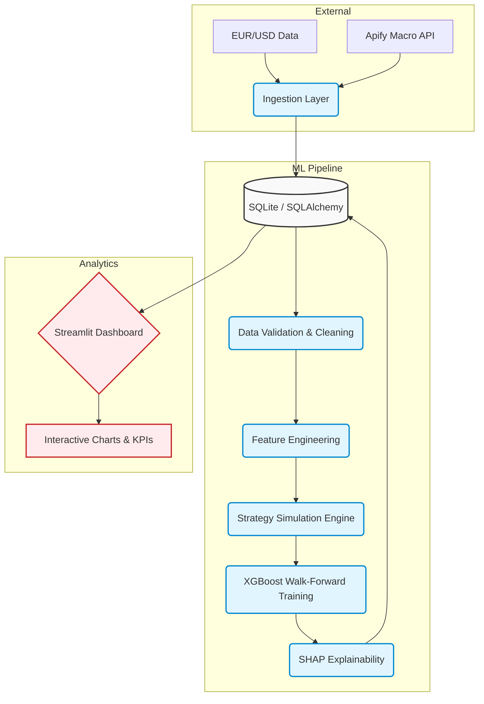

# QuantTrade ML Pipeline

Production-grade quantitative intelligence and ML-driven trading pipeline.


---

## 📷 Dashboard

> 📷 Screenshot coming soon

---

## Quick Highlights

- **Scale:** 93,000+ hourly EUR/USD candles (2005–2020) with live macroeconomic data scraping.
- **Robustness:** Timestamp-based walk-forward validation with embargo — works across any bar frequency.
- **Explainability:** Full SHAP integration for model transparency.
- **Optimization:** Automated hyperparameter tuning using Optuna TPE.
- **Analytics:** 12+ interactive Plotly dashboards decoupled from execution logic.
- **Reliability:** 81 automated tests covering ML pipeline, database, strategies, and validation.

---

## Features

### Data Engineering
- Automated Apify scraping for macroeconomic events
- Robust SQLite persistence layer with SQLAlchemy ORM
- Strict data validation and anomaly detection

### Feature Engineering
- **Time Features:** Session encoding, cyclical hours/days
- **Price Features:** Volatility windows, returns, spreads
- **Technical Indicators:** Bollinger Bands, EMA, SMA
- **Macro Features:** Priority-based event categorization, multi-keyword matching, matched category tracking

### Machine Learning
- XGBoost Regressor for PnL prediction
- Timestamp-driven walk-forward validation (supports minute, hourly, daily bars)
- Embargo period to prevent look-ahead bias from lagged features
- Optuna hyperparameter optimization
- SHAP feature importance tracking

### Trading Simulation
- 7 distinct quantitative trading strategies
- Dynamic risk management and position sizing
- Detailed trade logging and PnL calculation

### Dashboard
- Fully interactive Streamlit interface
- Pre-rendered Plotly visualizations
- Graceful missing-data handling
- Strategy radar and rolling metrics

---

## Architecture Diagram



---

## Tech Stack

| Category | Technology |
| :--- | :--- |
| **Language** | Python 3.14 |
| **Machine Learning** | XGBoost, Scikit-learn, Optuna, SHAP |
| **Data Processing** | Pandas, NumPy |
| **Database** | SQLite, SQLAlchemy (timezone-aware) |
| **Visualization** | Streamlit, Plotly Express |
| **Ingestion** | Apify Client |
| **Testing** | Pytest (81 tests) |

---

## Project Workflow

1. **Ingest:** Load historical forex data and scrape macro events.
2. **Preprocess:** Validate, clean, and align datasets.
3. **Feature Build:** Generate 60+ engineered features.
4. **Simulate:** Run 7 professional strategies to generate trade logs.
5. **Train:** Optimize and train XGBoost models using walk-forward validation.
6. **Evaluate:** Generate SHAP explanations and strategy recommendations.
7. **Visualize:** Explore insights via the Streamlit dashboard.

---

## Installation

```bash
git clone https://github.com/Dashwanth15/QuantTrade-ML-Pipeline.git
cd QuantTrade-ML-Pipeline

python -m venv .venv
source .venv/bin/activate  # On Windows: .venv\Scripts\activate

pip install -r requirements.txt
```

---

## Usage

**Execute Backend Pipeline:**
```bash
python scripts/run_pipeline.py
```

**Launch Analytics Dashboard:**
```bash
streamlit run app/main.py
```

---

## Project Structure

- `app/` — Streamlit dashboard and pages.
- `config/` — Environment variables and logging setup.
- `data/` — SQLite databases, datasets, and generated artifacts.
- `scripts/` — CLI execution scripts.
- `src/` — Core backend modules (ingestion, ML, features, simulation).
- `tests/` — Pytest unit and integration suites.

---

## Future Improvements

- Add support for high-frequency tick data.
- Integrate deep learning models (LSTMs/Transformers).
- Deploy dashboard via Docker and AWS ECS.
- Expand macro scraping to more economic calendars.

---

## ✨ Recent Improvements

The following upgrades were implemented after a technical review:

- **Walk-Forward Validation** — Replaced row-offset arithmetic with `pd.Timedelta` timestamp logic. The validator now works correctly for any bar frequency (milliseconds, seconds, minutes, hours, days).
- **Timezone-Aware Datetimes** — Removed all `datetime.utcnow()` calls (deprecated in Python 3.12+). All timestamps use `datetime.now(timezone.utc)`. SQLAlchemy models use `DateTime(timezone=True)`.
- **Macro Classifier** — Replaced first-match-wins classification with a priority-ranked system. Every event now stores a `primary_category`, `matched_categories`, and `matched_keywords`.
- **Test Coverage** — Expanded test suite to 81 tests covering the full ML pipeline, walk-forward validation across multiple frequencies, database layer, strategies, and feature engineering.

---

## 🧪 Testing

```bash
python -m pytest tests/ -v
```

| Suite | What It Covers |
| :--- | :--- |
| `test_pipeline.py` | ML pipeline, walk-forward validator (hourly/daily/minute) |
| `test_validation.py` | Leakage checks, embargo enforcement, fold integrity |
| `test_database.py` | ORM models, repository insert/load, session management |
| `test_strategies.py` | Trading strategy signals and PnL calculations |
| `test_features.py` | Time, price, and technical feature generation |

**Current status: ✅ 81 tests passed**

---

## License

This project is licensed under the MIT License.
