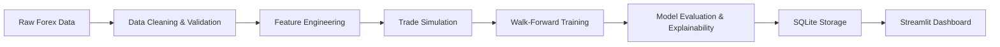

# QuantTrade ML Pipeline

A production-inspired quantitative machine learning pipeline for exploring EUR/USD market behavior, generating trading signals, training predictive models, and presenting results through an interactive analytics dashboard.

---

## Project Overview

QuantTrade ML Pipeline is a full-stack data science and software engineering project that brings together historical market data, macroeconomic context, feature engineering, backtesting, model training, and dashboard-based reporting.

The project was built to explore a practical question: can structured financial data and engineered market features be used to train a model that predicts trade-level outcomes and supports strategy evaluation?

The workflow is end-to-end. Data is ingested, cleaned, validated, transformed into features, used to simulate trading strategies, and then fed into an XGBoost-based training pipeline. Results are stored, visualized, and exposed through a Streamlit application.

This repository is best understood as a production-inspired learning project and internship-style engineering exercise rather than a live trading platform.

---

## Key Features

- Historical EUR/USD hourly market data ingestion and normalization
- Macroeconomic event integration for contextual feature generation
- Data validation and quality checks for market microstructure issues
- Feature engineering across time, price, technical, and macro dimensions
- Technical indicator generation for trading signal research
- Trade simulation with multiple rule-based strategies
- Walk-forward validation to reduce overfitting and improve time-series realism
- XGBoost regression training with hyperparameter optimization using Optuna
- SHAP-based model explainability for feature interpretation
- SQLite-backed persistence for datasets, trades, model runs, and predictions
- Interactive Plotly dashboards and downloadable reports
- Streamlit-based analytics interface for exploration and review
- Model artifact persistence for reproducible analysis and reuse

---

## System Architecture

The system follows a modular pipeline from raw data to interactive reporting.



This architecture keeps data preparation, strategy logic, model training, and visualization separate. That separation makes the project easier to test, extend, and review.

---

## Machine Learning Pipeline

### 1. Data Ingestion
Historical Forex OHLC data is loaded from CSV and normalized into a UTC-indexed dataset.

### 2. Data Cleaning
The cleaning layer handles missing values, OHLC consistency issues, weekend gaps, and spread anomalies. The goal is to preserve data quality without silently discarding too much signal.

### 3. Feature Engineering
Market and event-based features are generated to create an ML-ready feature matrix for trade prediction.

### 4. Trade Simulation
Several trading strategies are run against the engineered dataset to generate trade logs and performance summaries.

### 5. Walk-Forward Validation
Training is performed with time-aware cross-validation using rolling training and testing windows. This is more appropriate for temporal data than random splits.

### 6. Hyperparameter Optimization
Optuna is used to tune model hyperparameters for better predictive performance.

### 7. Model Training
An XGBoost regressor is trained to predict trade-level target values such as PnL-related outcomes.

### 8. Evaluation
The model is evaluated using regression metrics such as MAE, RMSE, and R², along with trading metrics including Sharpe ratio and win rate.

### 9. Prediction
The trained model can generate future predictions that are stored and visualized for review.

### 10. Dashboard
The Streamlit app provides an overview of the full workflow, including data, strategies, training results, and model explanations.

---

## Feature Engineering

The feature pipeline combines several classes of signals to build a robust input matrix.

| Feature Group | Purpose |
|---|---|
| Time Features | Capture cyclical and calendar-based behavior such as hour, day, and month effects |
| Price Features | Include returns, log returns, volatility proxies, and price-based momentum signals |
| Technical Indicators | Add RSI, MACD, EMA, SMA, Bollinger Bands, ATR, and related trend indicators |
| Macroeconomic Features | Incorporate event timing, impact scores, and proximity to economic releases |
| Trading Features | Provide context from prior trade behavior such as rolling win rate and prior PnL |

The feature store is designed to centralize feature creation and make the data preparation process more maintainable.

---

## Trading Strategies

The project includes a suite of quantitative strategies for generating trade logs and benchmarking ideas.

| Strategy | Description |
|---|---|
| Momentum | Trades when price momentum is strong and aligned with the trend filter |
| Moving Average Crossover | Uses fast and slow moving average crossings to identify trend changes |
| RSI Reversion | Looks for mean-reversion opportunities in ranging conditions |
| Bollinger Bands | Trades bounces near bands or breakouts following low-volatility periods |
| Breakout | Captures moves when price breaks recent high or low levels |
| Trend Following | Follows strong directional moves with pullback confirmation |
| Support & Resistance | Uses pivot-based levels and reversal confirmation around key zones |

These strategies are rule-based and intentionally simple. They serve as a practical foundation for strategy research and model training rather than a claim of market edge.

---

## Tech Stack

| Category | Tools |
|---|---|
| Programming | Python 3.11 |
| Machine Learning | XGBoost, scikit-learn, Optuna, SHAP, joblib |
| Data Processing | pandas, NumPy, SciPy |
| Database | SQLite, SQLAlchemy |
| Visualization | Plotly, Matplotlib, Seaborn |
| Dashboard | Streamlit |
| Configuration & Logging | pydantic, pydantic-settings, loguru |
| Testing | pytest |

The stack was chosen to balance readability, experimentation, and practical deployment-style structure.

---

## Project Screenshots

### Dashboard Overview

> Screenshot coming soon

### Market Data

> Screenshot coming soon

### Feature Engineering

> Screenshot coming soon

### Trade Simulation

> Screenshot coming soon

### Model Training

> Screenshot coming soon

### Evaluation

> Screenshot coming soon

### Predictions

> Screenshot coming soon

### Strategy Recommendation

> Screenshot coming soon

### Analytics

> Screenshot coming soon

### Downloads

> Screenshot coming soon

---

## Installation

This project uses Python and a virtual environment.

```bash
python -m venv .venv
source .venv/bin/activate
pip install -r requirements.txt
```

On Windows PowerShell, the activation command is typically:

```powershell
.venv\Scripts\Activate.ps1
```

If you are on Windows and want the helper script included in the repository, you can also run:

```powershell
setup_venv.bat
```

---

## Running the Project

### Pipeline Mode

Run the full end-to-end pipeline from ingestion through training and evaluation:

```bash
python main.py
```

This mode executes the orchestration workflow and generates datasets, model artifacts, reports, and charts.

### Dashboard Mode

Launch the Streamlit dashboard:

```bash
streamlit run app/main.py
```

The dashboard provides a more interactive view of the pipeline outputs and supports exploration of metrics, strategies, and model results.

---

## Project Structure

The repository is organized into a small set of clear modules.

- app/ — Streamlit pages and dashboard entry points
- src/ — Core pipeline logic for ingestion, preprocessing, features, simulation, ML, and visualization
- config/ — Project settings and logging configuration
- data/ — Raw data, processed datasets, generated charts, and saved model outputs
- models/ — Persisted model artifacts
- tests/ — Unit and integration tests for key components
- scripts/ — Helper scripts for running pipeline tasks

This structure is intentionally simple and easy to navigate for review and extension.

---

## Future Improvements

The next logical improvements would be:

- Cloud deployment or containerization for easier reproducibility
- Integration with live market data feeds
- Additional predictive models beyond XGBoost
- More advanced trading strategies and risk controls
- MLOps-style experiment tracking and model registry support
- Better deployment and monitoring workflow for scheduled retraining

These improvements would move the project from a strong research prototype toward a more production-ready system.

---

## Learning Outcomes

This project demonstrates several practical engineering and machine learning concepts:

- End-to-end data pipeline design
- Time-series-aware validation techniques
- Feature engineering for financial signals
- Rule-based strategy simulation and evaluation
- Model training, explainability, and artifact persistence
- Software architecture for a data product with a web-based interface

It is a useful example of how a data scientist or ML engineer can combine modeling, software engineering, and product presentation in one repository.

---

## License

MIT License placeholder.

This repository can be licensed under MIT once the final legal and repository ownership details are confirmed.
# QuantTrade-ML-Pipeline

