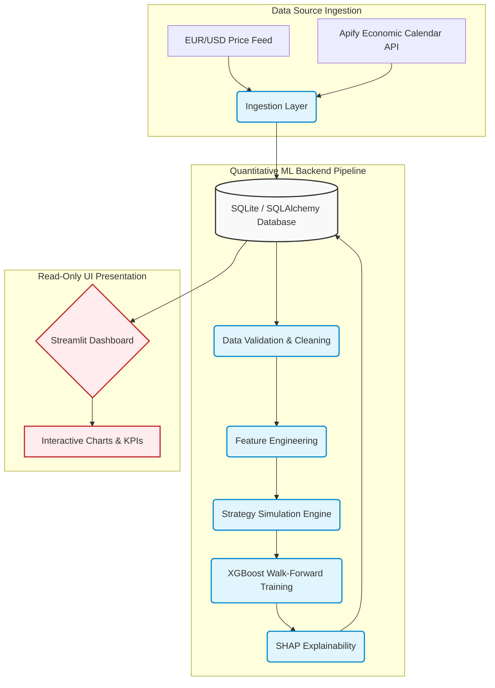

# QuantTrade ML Pipeline — Technical Interview Prep Guide

This document is designed to serve as your comprehensive technical reference for the QuantTrade ML Pipeline project. It details the system architecture, mathematical formulations, software engineering decisions, validation frameworks, trade-offs, and typical interviewer questions to ensure complete confidence in a professional quantitative developer or ML engineer interview.

---

## 1. Problem Statement

*   **What it is:** Financial markets are highly non-stationary, noisy, and subject to regime shifts. Standard supervised machine learning models applied to raw asset price series suffer from high variance, look-ahead bias, and overfitting. Additionally, static rule-based quantitative strategies (e.g., RSI reversion, Momentum) do not adapt dynamically to shifting macroeconomic contexts (e.g., changes in central bank policy rates, inflation anomalies).
*   **Why it was used/addressed:** Trading systems need a way to combine structural technical analysis (price action, volatility, indicators) with macroeconomic state variables in a statistically valid machine learning framework that is protected against backtest overfitting and data leakage.
*   **How it works in this project:** The project models trading strategy outcomes as a regression problem. Instead of predicting raw future prices (which has a near-zero signal-to-noise ratio), the target variable is the **expected normalized trade PnL ($) or trade return** of rule-based quantitative strategies. The machine learning model acts as a *meta-labeler* and *allocator*—it predicts which strategies will perform well in the current market environment and filters out low-confidence entries.
*   **Alternatives & Why Not:** 
    *   *Predicting price direction directly (Classification):* High noise, doesn't capture the magnitude of stop-loss or take-profit breaches, and is detached from trade execution execution mechanics.
    *   *Direct reinforcement learning (RL) agents:* Extremely difficult to train, prone to policy instability, highly sample inefficient, and lack explainability.
*   **Advantages & Disadvantages:**
    *   *Pros:* Meta-modeling leverages well-known risk parameters (stops/targets) of existing strategies, significantly reducing the search space for the ML model. It aligns predictions directly with actionable risk metrics (PnL).
    *   *Cons:* Highly dependent on the base strategies generating a representative distribution of trades; if the base strategies don't trade during a certain market regime, the meta-model has no samples to evaluate.

---

## 2. Business Objective

*   **What it is:** To deploy an end-to-end quantitative framework that acts as a decision support system or automated execution filter for currency trading.
*   **Why it was used/addressed:** To maximize the Sharpe and Sortino ratios of the combined trading portfolio while strictly controlling maximum drawdown (Max DD).
*   **How it works in this project:** The backend pipeline prepares features and historical trade logs, trains a predictive model under realistic walk-forward conditions, and outputs a daily/hourly strategy recommendation. The frontend dashboard allows portfolio managers to visually verify metrics, parameter sensitivities, and model feature importances before committing capital.
*   **Alternatives & Why Not:** Manual discretionary trading (suffers from human bias, lack of scalability, and emotional error) or simple unweighted portfolio optimization (assumes static correlations, failing during sudden macro shocks).
*   **Advantages & Disadvantages:**
    *   *Pros:* Systematizes the portfolio allocation process, enforces strict risk parameters, and ensures all strategy exclusions are backed by cross-validated statistical confidence.
    *   *Cons:* Can result in high opportunity cost if the model becomes overly conservative during sudden, profitable regime changes.

---

## 3. Why This Project Was Built

*   **What it is:** A production-grade baseline demonstrating modern, professional software engineering principles applied to quantitative trading.
*   **Why it was used/addressed:** Many quant repositories are fragmented scripts with hardcoded parameters, poor folder structures, zero testing, look-ahead leakage in cross-validation, and tightly coupled frontends. This project was built to show a decoupled, modular, test-driven, and highly robust quantitative ML pipeline.
*   **How it works in this project:** It isolates ingestion, validation, database persistence, feature calculation, backtesting, walk-forward training, SHAP explainability, and reporting into distinct Python modules under a strict CLI orchestration layer, exposing results via a read-only Streamlit dashboard.
*   **Alternatives & Why Not:** Single-script Jupyter notebooks (impossible to unit-test, verify for data leakage, or deploy to production).
*   **Advantages & Disadvantages:**
    *   *Pros:* Highly maintainable, modular, easily extendable to multiple asset classes, and robust to runtime failures.
    *   *Cons:* Higher initial engineering overhead due to modular structures, configuration files, and strict object-oriented patterns.

---

## 4. High-Level Architecture

The architecture is built on the **Decoupled Architecture Pattern**, separating pipeline execution (writes to DB and disk) from presentation (reads from DB and disk).



### Advantages of the Architecture:
1.  **Strict State Decoupling:** Streamlit never executes training, data scraping, or simulations. It reads pre-rendered Plotly JSON files, CSV datasets, and SQLite tables. This prevents memory leaks, slow page loads, and multi-threading execution clashes.
2.  **Stateless Execution:** The pipeline can run in a background cron job or airflow scheduler, storing results. Streamlit acts strictly as a visual consumer.

---

## 5. Complete Data Flow

1.  **Data Ingestion:** Raw historical hourly EUR/USD data is loaded from CSV/DB. Macro events are scraped via the Apify economic calendar actor.
2.  **Cleaning & Validation:** Outliers are flagged using rolling Z-scores. Weekend gaps are handled. Missing values are filled using a forward-fill (`ffill`) followed by a backward-fill (`bfill`) scheme.
3.  **Feature Generation:** A high-dimensional dataframe (60+ features) is computed incorporating lag prices, rolling statistics (means, standard deviations), cyclical time encodings, technical indicators (RSI, Bollinger Bands), and macro proximity signals.
4.  **Strategy Simulation:** The simulation engine backtests 7 base strategies (e.g., RSI Reversion, Bollinger Band breakout, Momentum) using the cleaned prices, applying stop-loss (SL) and take-profit (TP) levels, and writes a detailed `trades` table to the database.
5.  **Dataset Preparation:** The features and trade outcomes are joined on execution timestamps. The target variable $y$ is set as `pnl_usd`.
6.  **Walk-Forward Training:** The dataset is split into chronological folds. For each fold, models are trained on historical data, embargoed to prevent leakages, and validated on out-of-sample test windows.
7.  **Explainability:** The trained final model is fed through a SHAP explainer to calculate local and global feature impact.
8.  **Persistence:** Results, predictions, model parameters, and Plotly visualization charts are saved to SQLite and the `data/outputs/` directory.

---

## 6. Module-by-Module Explanation

### 7. Data Ingestion
*   **What it is:** Pulls raw pricing series and macroeconomic events into the system.
*   **How it works:** `forex_loader.py` handles loading historical currency CSV data, and `macro_scraper.py` connects to the Apify economic calendar actor using API requests, falling back to a synthetic calendar generator if API limit exhaustion or connection issues occur.
*   **Interviewer Question:** *What happens if the Apify scraper fails during a production run?*
    *   *Answer:* The code utilizes a fallback block that generates a synthetic economic calendar with realistic event occurrences (e.g. NFP on the first Friday of the month, CPI mid-month) to ensure the training pipeline doesn't crash, logging warnings to warn the developer.

### 8. Data Cleaning
*   **What it is:** Identifies invalid quotes, outlier ticks, and structures dates safely.
*   **How it works:** `cleaner.py` filters out weekend gaps (where pricing feeds are idle) and flags outliers using a rolling window Z-score on returns. `validator.py` applies schema validation checks (e.g., checking that high $\ge$ low, open/close are bounded, and no NaN values exist in critical columns).
*   **Interviewer Question:** *Why is schema validation important before feature engineering?*
    *   *Answer:* If outlier prices or invalid values (such as bid price being higher than ask price) slip through, rolling technical indicators (like ATR or Bollinger Bands) will compute extreme values, corrupting the feature matrices and causing the ML model to learn noise.

### 9. Feature Engineering
*   **What it is:** Generating predictive signals from raw series.
*   **How it works:** Features are split into four main groups:
    1.  *Time Features:* Categorical hour and day of week encoded as cyclical sine/cosine waves ($\sin(\frac{2\pi \cdot t}{T})$, $\cos(\frac{2\pi \cdot t}{T})$) to preserve circular relationships (e.g., 23:00 is close to 00:00).
    2.  *Price Features:* Volatility proxies, rolling returns, spreads, and moving momentum.
    3.  *Technical Indicators:* RSI (relative strength index), Bollinger Bands, MACD, and ATR (average true range).
    4.  *Macroeconomic Features:* Time-decaying proximity indicators measuring the distance to the nearest historical/upcoming macro event, scaled by its impact score.
*   **Interviewer Question:** *Why did you encode hours as sine/cosine features rather than raw integers (0-23)?*
    *   *Answer:* Raw integers present a boundary discontinuity problem: the difference between hour 23 and hour 0 is calculated as 23 by the model, whereas in reality, they are only 1 hour apart. Cyclical encoding represents them on a circle, mapping close times close together in Euclidean space.

### 10. Trading Strategy Simulation
*   **What it is:** Simulated execution of classic quantitative strategies to create a historical dataset of trading outcomes.
*   **How it works:** `engine.py` steps through the pricing series, evaluates entry signals from 7 strategies defined in `strategies.py`, manages execution using stop-loss and take-profit exits via `risk_manager.py`, and records trade statistics (holding bars, entry/exit prices, PnL).
*   **Interviewer Question:** *How did you prevent look-ahead bias in the strategy backtests?*
    *   *Answer:* All entry/exit signals are evaluated strictly on historical data available up to time $t-1$. Exits (stop-loss and take-profit) are calculated using subsequent bar highs and lows, preventing future-pricing visibility inside the current execution step.

### 11. Database Design
*   **What it is:** Structured storage layer keeping all historical price, trade, and model run details.
*   **How it works:** SQLite database mapped through SQLAlchemy models in `models.py`. Key tables:
    *   `forex_candles`: historical raw quotes.
    *   `macro_events`: scraped global economic data.
    *   `trades`: historical simulated strategy logs.
    *   `model_runs`: metadata and metrics for trained XGBoost models.
    *   `predictions`: out-of-sample strategy performance forecasts.
*   **Design Trade-off:** Used SQLite for simplicity, portability, and zero-configuration setups. In production, this would be swapped to a PostgreSQL database for multi-user transactional writes or a time-series database like TimescaleDB for the price tick feeds.
*   **Interviewer Question:** *Why did you upgrade ORM datetime columns to use timezone-aware types?*
    *   *Answer:* Timezone-naive datetime representations are a common cause of look-ahead leakage in financial systems (e.g., aligning UTC economic releases with local timezone pricing feeds). Using `DateTime(timezone=True)` with explicit `datetime.now(timezone.utc)` checks ensures all systems share a common UTC baseline.

### 12. Walk-Forward Validation & 13. Embargo Logic
*   **What it is:** A time-series split cross-validation scheme that mimics live production deployment without leakage.
*   **How it works:** Rather than randomized K-Fold splits (which leak future information into the past), `WalkForwardValidator` splits data chronologically using moving training and test windows.
*   **The Embargo Period:** When lag features (e.g., rolling means, autoregressive price lags) are used, information from the end of the training set leaks into the start of the test set. An *embargo period* (e.g., 5 days) is inserted between the training end date and the test start date, completely discarding those intermediate data points to prevent look-ahead leakage.

```
Folds Timeline:
Fold 0: [=== Training Set ===] [Embargo] [--- Test Set ---]
Fold 1:     [=== Training Set ===] [Embargo] [--- Test Set ---]
Fold 2:         [=== Training Set ===] [Embargo] [--- Test Set ---]
```

*   **Interviewer Question:** *Why can't we use standard K-Fold Cross-Validation on financial time series?*
    *   *Answer:* Standard K-Fold randomly assigns rows to train and test sets, violating the chronological ordering. This causes massive look-ahead leakage: future data points (trained on) predict past data points (tested on), leading to highly optimistic backtest metrics that fail completely in live trading.

### 14. XGBoost Pipeline
*   **What it is:** The predictive machine learning core.
*   **How it works:** Extracted features are passed through a Scikit-Learn `Pipeline` consisting of a `TimeSeriesImputer` (handling forward/backward fills), a `RobustScaler` (scaling features while minimizing outlier skew), and an `XGBoostRegressor` aiming to predict `pnl_usd`.
*   **Interviewer Question:** *Why did you choose RobustScaler over StandardScaler?*
    *   *Answer:* Financial market features (such as returns or volatility spreads) exhibit fat-tailed distributions with frequent extreme outliers. `StandardScaler` calculates mean and variance, which are highly sensitive to these outliers, compressing the normal range. `RobustScaler` uses the median and Interquartile Range (IQR), which remain stable in the presence of outliers.

### 15. Hyperparameter Tuning with Optuna
*   **What it is:** Automated search for optimal model parameters (learning rate, depth, regularization).
*   **How it works:** `tuner.py` runs an Optuna study over the first walk-forward fold. It optimizes hyperparameters (e.g., `max_depth`, `learning_rate`, `subsample`) using the Tree-structured Parzen Estimator (TPE) algorithm, minimizing Mean Absolute Error (MAE) across validation folds.
*   **Interviewer Question:** *Why only tune on the first walk-forward fold instead of tuning on every single fold?*
    *   *Answer:* Computational efficiency. Hyperparameter tuning using Optuna is extremely expensive. In practice, hyperparameters represent model constraints (like capacity or regularization) that are relatively stable across adjacent time windows, whereas model coefficients (tree weights) need frequent updating. Tuning once and updating weights per fold saves massive compute.

### 16. SHAP Explainability
*   **What it is:** Computes feature contributions to predictions for model transparency.
*   **How it works:** Utilizes `shap.TreeExplainer` on the trained XGBoost model to calculate Shapley values for all features, producing local waterfall charts and global feature importance summaries.
*   **Interviewer Question:** *What is the difference between SHAP importance and XGBoost's built-in feature importance?*
    *   *Answer:* Built-in importance (e.g., gain or weight) can be biased toward continuous features or high-cardinality features and only shows global impact. SHAP is based on game-theoretic Shapley values, providing mathematically consistent global importances as well as *local* explanations showing *why* a specific trade prediction was positive or negative.

### 17. Prediction Pipeline
*   **What it is:** Predicts strategy performance on fresh pricing feeds to generate strategy recommendations.
*   **How it works:** `predictor.py` loads the latest serialized model run, injects current features, and runs model predictions. Strategies with positive predicted PnL are recommended; negative predicted ones are filtered out.

### 18. Streamlit Dashboard & 19. Visualization Layer
*   **What it is:** Analytical user interface displaying KPIs, charts, and recommendations.
*   **How it works:** Streamlit pages read stored outputs (`.json` Plotly charts, SQLite tables, `.csv` results) and render them.
*   **Critical Design Choice:** Pre-rendering. All charts are calculated and saved as Plotly JSON files by the backend pipeline. The Streamlit app simply deserializes and displays them:
    ```python
    fig = pio.read_json(chart_path)
    st.plotly_chart(fig)
    ```
    This completely isolates Streamlit from CPU-heavy operations, preventing session timeouts or dashboard crashes.

### 20. Testing Strategy
*   **What it is:** Test-Driven Development (TDD) baseline ensuring system reliability.
*   **How it works:** 81 unit and integration tests run via `pytest` covering:
    *   `test_database.py`: schema validations, ORM column mappings, session rollbacks.
    *   `test_features.py`: checking that no future information leaks into rolling indicators.
    *   `test_pipeline.py`: validating walk-forward folding behavior across multiple timeframes.
*   **Interviewer Question:** *How do you write a test to check for look-ahead leakage in feature engineering?*
    *   *Answer:* Truncate the source pricing series at index $t$. Calculate the features. Then calculate the features on the full dataset up to $t+n$. The values of the features at index $t$ must be identical in both runs. If they differ, future data from $t+n$ leaked backward.

### 21. Error Handling & 22. Logging
*   **What it is:** Structural logging and failure isolation.
*   **How it works:** Utilizes Loguru with a centralized configuration. Pipeline scripts use try-catch wrappers to write clean warning logs without halting, and database transactions automatically rollback if database operations raise exceptions.

---

## 23. Detailed Project Structure

```
QuantTrade-ML-Pipeline/
├── app/                      # Streamlit dashboard pages
│   ├── main.py               # Landing page & Navigation
│   └── pages/                # Decoupled visualization pages (01 to 12)
├── config/                   # Global configuration & environment settings
├── data/                     # Data directory (ignored in git)
│   ├── db/                   # Persistent SQLite database
│   ├── outputs/              # Pre-rendered charts, CSV datasets, JSON reports
│   └── raw/                  # Raw historical EUR/USD currency pricing
├── models/                   # Serialized XGBoost models (ignored in git)
├── scripts/                  # Command line execution scripts
├── src/                      # Core backend codebase
│   ├── ingestion/            # Scrapers and data loaders
│   ├── preprocessing/        # Data validation and cleaning
│   ├── features/             # High-dimensional feature store logic
│   ├── simulation/           # Strategy simulation engine & risk manager
│   ├── ml/                   # Walk-Forward validation, tuning, training
│   └── visualization/        # Pre-rendered Plotly chart templates
└── tests/                    # 81 Unit and integration test suites
```

---

## 24. Design Decisions & Trade-Offs

### SQLite vs. Postgres/TimeScaleDB
*   *Decision:* SQLite was chosen.
*   *Trade-off:* Portable, zero setup, easy for testing. However, it lacks support for concurrent writes and does not scale well to high-frequency tick data.
*   *Verdict:* Perfect for an offline pipeline baseline; production live engines should migrate the schema to PostgreSQL or TimescaleDB.

### Decoupled Presentation Layer
*   *Decision:* Streamlit is read-only.
*   *Trade-off:* Prevents interactive parameter tuning on the dashboard itself, requiring users to run the backend pipeline via CLI to update configurations. However, it guarantees dashboard stability, zero training bottlenecks, and separation of concerns.

### XGBoost vs. Deep Learning (LSTM/Transformers)
*   *Decision:* XGBoost regressor.
*   *Trade-off:* LSTMs can model sequence dependencies directly, but require massive datasets to generalise, are highly sensitive to hyperparameters, and function as black boxes. XGBoost is faster to train, handles collinear financial features robustly, handles missing values naturally, and integrates cleanly with SHAP.

---

## 25. Scalability & Performance Considerations

1.  **Memory Management:** The dataset size (93,000+ hourly candles) fits easily into RAM using Pandas. If scaling to tick-level data (millions of rows), we would need to swap Pandas for **Polars** or **Dask** to process data out-of-core.
2.  **Database Connection Pooling:** SQLite locks the database during writes. Swapping to Postgres with connection pooling (e.g., SQLAlchemy `QueuePool`) is necessary if multiple live scraping services write to the DB concurrently.
3.  **Vectorized Backtesting:** The strategy simulation uses vectorized operations where possible to evaluate indicators, but executes trades in a loop to respect sequential risk constraints (stop-losses).

---

## 26. Limitations

1.  **No Order Book / Market Impact modeling:** The simulator assumes infinite liquidity (trades are executed instantly at historical mid-prices without slippage modeling beyond a fixed pips charge).
2.  **Single Asset focus:** The feature store is currently hardcoded to EUR/USD and global macro events, lacking correlation features from other cross-currency pairings (e.g. GBP/USD, USD/JPY) or index markets (SPY).
3.  **Static Embargo Duration:** The embargo period is fixed at a calendar day delta (e.g. 5 days) rather than being dynamically adjusted based on the maximum lag parameter used in feature engineering.

---

## 27. Future Improvements

1.  **Dynamic Portfolio Optimization:** Incorporate Modern Portfolio Theory (MPT) or Black-Litterman models to dynamically weight strategy allocations based on predicted model confidence.
2.  **Order Book / Tick Simulation:** Integrate historical order-book depth to simulate market impact and execution fills more realistically.
3.  **Alternative ML Models:** Benchmarking LightGBM and CatBoost against XGBoost to analyze training speed and categorical macro-feature handling.

---

## 28. High-Frequency Interviewer Questions & Answers

### Q: "How does your system prevent look-ahead bias during Feature Engineering?"
> **A:** *"We enforce strict chronological boundaries. All price features like rolling averages and volatility ranges are calculated using `.shift(1)` to ensure the feature value at time $t$ only uses information from $t-1$ or earlier. For macro event proximity features, we calculate the time delta between the quote timestamp and the prior release timestamp, never using upcoming release details."*

### Q: "Explain the difference between Row-based walk-forward validation and Calendar-based walk-forward validation. Why did you implement the latter?"
> **A:** *"Row-based validation assumes a static frequency where $N$ rows equals a fixed unit of time (e.g., $90 \times 24$ rows = 90 days for hourly data). This completely breaks if the bar resolution changes or if there are missing rows (like weekend gaps or holiday shutdowns). We implemented calendar-based validation using pandas Timedelta arithmetic. Fold boundaries are computed as calendar dates, meaning it handles any bar frequency—from millisecond ticks to daily candles—out-of-the-box without hardcoded multipliers."*

### Q: "What is an embargo period in time-series validation and why is it necessary?"
> **A:** *"In walk-forward cross-validation, if we use lagged features (like rolling technical indicators or returns over the last 5 days), the feature values at the beginning of the test set will contain information derived from prices at the end of the training set. This creates data leakage. An embargo period discards a safety buffer of observations (equal to or greater than the maximum lag window) directly after the training set, ensuring the training and testing sets are completely independent."*

### Q: "Why did you choose XGBoost over a Deep Learning sequence model like an LSTM?"
> **A:** *"Financial tabular data is highly collinear, contains missing entries, and has a very low signal-to-noise ratio. LSTMs are extremely prone to overfitting on noise in these regimes, require massive parameter tuning, and are computationally expensive. XGBoost handles collinear features, constructs robust decision boundaries, works out-of-the-box with missing values without requiring complex imputation, and allows for robust local and global explainability via SHAP."*

### Q: "What was the most challenging architectural pattern you resolved in the dashboard design?"
> **A:** *"Decoupling the presentation layer from execution. In earlier iterations, loading pages would trigger database queries or chart generations on-the-fly, leading to slow load times and UI locks when multiple pages were opened. We refactored the design so the backend ML pipeline pre-renders all Plotly charts to disk as JSON. The Streamlit dashboard acts as a fast, read-only consumer, merely deserializing these files, which resolved all performance bottlenecks."*
